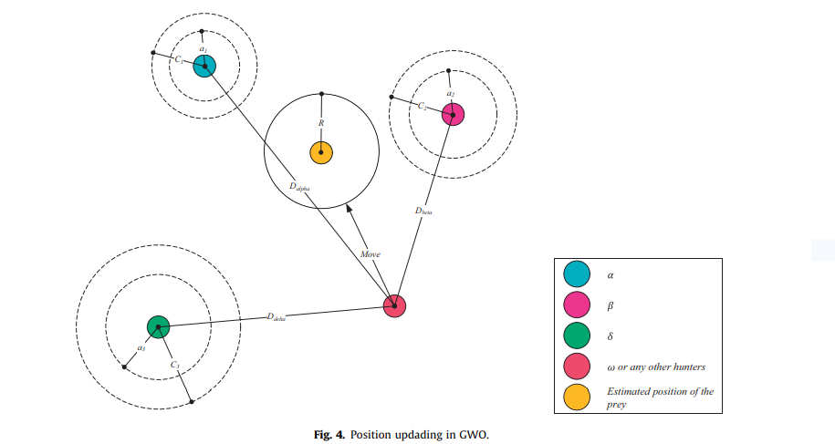

**GREY WOLF OPTIMISATION**

{width="6.25in"
height="3.95in"}

**Nistha Singh (2018BCSE073)**

**Prabhanshu Chauhan (2018BCSE074)**

**Raman Kishore Singh (2018BCSE075)**

**INTRODUCTION**

A metaheuristic is a nature inspired algorithmic framework designed to
provide a

near-optimal solution to an optimization problem. These algorithms are
preferred

especially when the available information is not complete and
computational capac-

ities are limited \[1\]. Metaheuristic is different from heuristic as it
is not application

specific and may be applied for a variety of problems with a few
assumptions. These

algorithms are applied when the solution space is too large to be
completely sampled

\[2\]. These are nondeterministic in nature. Metaheuristic algorithms
include simple

local search procedures and also complicated learning phases. Many
metaheuristic

algorithms have been studied in literature and new variants are still
emerging. Genetic

Algorithm (GA), simulated annealing, Particle Swarm Technique of
Optimization

(PSO), tabu search, memetic algorithm, Ant Colony Algorithms for
optimization

(ACO) are some of the popularly studied algorithms in this field.

A metaheuristic is a nature inspired algorithmic framework designed to
provide a

near-optimal solution to an optimization problem. These algorithms are
preferred

especially when the available information is not complete and
computational capac-

ities are limited \[1\]. Metaheuristic is different from heuristic as it
is not application

specific and may be applied for a variety of problems with a few
assumptions. These

algorithms are applied when the solution space is too large to be
completely sampled

\[2\]. These are nondeterministic in nature. Metaheuristic algorithms
include simple

local search procedures and also complicated learning phases. Many
metaheuristic

algorithms have been studied in literature and new variants are still
emerging. Genetic

Algorithm (GA), simulated annealing, Particle Swarm Technique of
Optimization

(PSO), tabu search, memetic algorithm, Ant Colony Algorithms for
optimization

(ACO) are some of the popularly studied algorithms in this field.

A metaheuristic is a nature inspired algorithmic framework designed to
provide a

near-optimal solution to an optimization problem. These algorithms are
preferred

especially when the available information is not complete and
computational capac-

ities are limited \[1\]. Metaheuristic is different from heuristic as it
is not application

specific and may be applied for a variety of problems with a few
assumptions. These

algorithms are applied when the solution space is too large to be
completely sampled

\[2\]. These are nondeterministic in nature. Metaheuristic algorithms
include simple

local search procedures and also complicated learning phases. Many
metaheuristic

algorithms have been studied in literature and new variants are still
emerging. Genetic

Algorithm (GA), simulated annealing, Particle Swarm Technique of
Optimization

(PSO), tabu search, memetic algorithm, Ant Colony Algorithms for
optimization

(ACO) are some of the popularly studied algorithms in this field.

A metaheuristic is a nature inspired algorithmic framework designed to
provide a

near-optimal solution to an optimization problem. These algorithms are
preferred

especially when the available information is not complete and
computational capac-

ities are limited \[1\]. Metaheuristic is different from heuristic as it
is not application

specific and may be applied for a variety of problems with a few
assumptions. These

algorithms are applied when the solution space is too large to be
completely sampled

\[2\]. These are nondeterministic in nature. Metaheuristic algorithms
include simple

local search procedures and also complicated learning phases. Many
metaheuristic

algorithms have been studied in literature and new variants are still
emerging. Genetic

Algorithm (GA), simulated annealing, Particle Swarm Technique of
Optimization

(PSO), tabu search, memetic algorithm, Ant Colony Algorithms for
optimization

(ACO) are some of the popularly studied algorithms in this field.

A metaheuristic is a nature inspired algorithmic framework designed to
provide a

near-optimal solution to an optimization problem. These algorithms are
preferred

especially when the available information is not complete and
computational capac-

ities are limited \[1\]. Metaheuristic is different from heuristic as it
is not application

specific and may be applied for a variety of problems with a few
assumptions. These

algorithms are applied when the solution space is too large to be
completely sampled

\[2\]. These are nondeterministic in nature. Metaheuristic algorithms
include simple

local search procedures and also complicated learning phases. Many
metaheuristic

algorithms have been studied in literature and new variants are still
emerging. Genetic

Algorithm (GA), simulated annealing, Particle Swarm Technique of
Optimization

(PSO), tabu search, memetic algorithm, Ant Colony Algorithms for
optimization

(ACO) are some of the popularly studied algorithms in this field.

A metaheuristic is a nature inspired algorithmic framework designed to
provide a

near-optimal solution to an optimization problem. These algorithms are
preferred

especially when the available information is not complete and
computational capac-

ities are limited \[1\]. Metaheuristic is different from heuristic as it
is not application

specific and may be applied for a variety of problems with a few
assumptions. These

algorithms are applied when the solution space is too large to be
completely sampled

\[2\]. These are nondeterministic in nature. Metaheuristic algorithms
include simple

local search procedures and also complicated learning phases. Many
metaheuristic

algorithms have been studied in literature and new variants are still
emerging. Genetic

Algorithm (GA), simulated annealing, Particle Swarm Technique of
Optimization

(PSO), tabu search, memetic algorithm, Ant Colony Algorithms for
optimization

(ACO) are some of the popularly studied algorithms in this field.

A metaheuristic is a nature inspired algorithmic framework designed to
provide a

near-optimal solution to an optimization problem. These algorithms are
preferred

especially when the available information is not complete and
computational capac-

ities are limited \[1\]. Metaheuristic is different from heuristic as it
is not application

specific and may be applied for a variety of problems with a few
assumptions. These

algorithms are applied when the solution space is too large to be
completely sampled

\[2\]. These are nondeterministic in nature. Metaheuristic algorithms
include simple

local search procedures and also complicated learning phases. Many
metaheuristic

algorithms have been studied in literature and new variants are still
emerging. Genetic

Algorithm (GA), simulated annealing, Particle Swarm Technique of
Optimization

(PSO), tabu search, memetic algorithm, Ant Colony Algorithms for
optimization

(ACO) are some of the popularly studied algorithms in this field.

A metaheuristic is a nature inspired algorithmic framework designed to
provide a

near-optimal solution to an optimization problem. These algorithms are
preferred

especially when the available information is not complete and
computational capac-

ities are limited \[1\]. Metaheuristic is different from heuristic as it
is not application

specific and may be applied for a variety of problems with a few
assumptions. These

algorithms are applied when the solution space is too large to be
completely sampled

\[2\]. These are nondeterministic in nature. Metaheuristic algorithms
include simple

local search procedures and also complicated learning phases. Many
metaheuristic

algorithms have been studied in literature and new variants are still
emerging. Genetic

Algorithm (GA), simulated annealing, Particle Swarm Technique of
Optimization

(PSO), tabu search, memetic algorithm, Ant Colony Algorithms for
optimization

(ACO) are some of the popularly studied algorithms in this field.

population-based metaheuristics that copy the natural behavior of
swarms, flocks,

population-based metaheuristics that copy the natural behavior of
swarms, flocks,

The grey wolf optimizer (GWO) as a novel swarm intelligent optimization
algorithm was put forward by Seyedali Mirjalili etc in 2014, which
mainly mimics wolf leadership hierarchy and hunting mechanism in nature.
Seyedali and Mirjalili etc has proved that the optimization performance
of standard GWO is superior to that of PSO, GSA, DE and FEP algorithm.
Due to the wolves algorithm with the advantages of simple in principle,
fast seeking speed, high search precision, and easy to realize, it is
more easily combined with the practical engineering problems. Therefore,
GWO has high theoretical research value. But GWO is as a new biological
intelligence algorithm, the research about it is just at the initial
phase, so research and development of the theory are still not perfect.
In order to make the algorithm plays a more superior performance,
further exploration and research is needed.

Many swarm intelligence algorithms are mimic the hunting and searching
behaviors of some animals. However, GWO simulates internal leadership
hierarchy of wolves, thus, in the searching process the position of best
solution can be comprehensively assessed by three solutions. But for
other swarm intelligence algorithms, the best solution is searched only
leaded by a single solution. So GWO can greatly decrease the probability
of premature and falling into the local optimum. So as to achieve the
proper compromise between exploration and exploitation, an improved GWO
with evolution and elimination mechanism is proposed. The biological
evolution and the SOF principle of biological updating of nature are
added to the basic wolf algorithm. In order to verify the performance of
the improved GWO, 12 typical benchmark functions are adopted to carry
out simulation experiments, meanwhile, experimental results are compared
with PSO algorithm, ABC algorithm and CS algorithm. The experimental
results show that the improved grey wolf optimizer (IGWO) obtains the
better convergence velocity and optimization accuracy.

**INSPIRATION**

Grey wolf (Canis lupus) belongs to Canidae family. Grey wolves are
considered as apex predators, meaning that they are at the top of the
food chain. Grey wolves mostly prefer to live in a pack. The group size
is 5--12 on average.

In order to mimic wolves internal leadership hierarchy, the wolves are
divided into four types of wolf: ***alpha***, ***beta***, ***delta***
and ***omega***, where the best individual, second best individual and
third best individual are recorded as ***alpha***, ***beta***, and
***delta***, and the rest of the individuals are considered as
***omega***. In the GWO, the hunting (optimization) is guided by alpha,
beta, and delta. They guide other wolves (W) tend to the best area in
searching space. In iterative searching process, the possible position
of prey is assessed by three wolves- alpha, beta, and delta.

**ALPHA WOLVES:** The alpha wolves are the leaders of the pack and they
are a male and a female.

-   They are responsible for making decisions about hunting, time to
    walk, and sleeping place and so on.

-   The pack members have to dictate the alpha decisions and they
    acknowledge the alpha by holding their tails down.

-   The alpha wolf is considered the dominant wolf in the pack and all
    his/her orders should be followed by the pack members.

**BETA WOLVES:** The betas are subordinate wolves, which help the alpha
in decision making.

-   The beta wolf can be either male or female and it consider the best
    candidate to be the alpha when the alpha passes away or becomes very
    old.

-   The beta reinforce the alpha\'s commands throughout the pack and
    gives the feedback to alpha.

**DELTA WOLVES:** The delta wolves are not alpha or beta wolves and they
are called subordinates.

-   Delta wolves have to submit to the alpha and beta but they dominate
    the omega (the lowest level in wolves social hierarchy).

-   There are different categories of delta as follows:-

```{=html}
<!-- -->
```
-   **Scouts:-** The scout wolves are responsible for watching the
    boundaries of the territory and warning the pack in case of any
    danger.

-   **Sentinels:-** The sentinel wolves are responsible for protecting
    the pack. Elders:- The elder wolves are the experienced wolves who
    used to be alpha or beta.

-   **Hunters:-** The hunters wolves are responsible for helping the
    alpha and beta wolves in hunting and providing food for the pack.

-   **Caretakers:-** The caretakers are responsible for caring for the
    ill, weak and wounded wolves in the pack.

**OMEGA WOLVES:** The omega wolves are considered the scapegoat in the
pack, they have to submit to all the other dominant wolves.

-   They may seem are not important individuals in the pack and they are
    the last allowed wolves to eat.

-   The whole pack are fighting in case of losing the omega.

**SOCIAL HIERARCHY OF WOLVES**

-   The Fittest solution as an Alpha wolf (α)

-   Second best solution as a Beta wolf (β)

-   Third best solution as a Delta wolf (δ)

-   Rest of the candidate solutions as Omega wolves (ω)

Hierarchy of grey wolf (dominance decreases from top down).

**GREY WOLF HUNTING**

-   Tracking, chasing and approaching the prey.

-   Pursuing, encircling, and harassing the prey until it stops moving.

-   Attack towards the prey.

**MATHEMATICAL REPRESENTATION**

1.  **Encircling the Prey:-**

$\overrightarrow{D} = |\overrightarrow{C}.{\overrightarrow{X}}_{p}(t) - \overrightarrow{X}(t)|$
(1)

$\overrightarrow{X}(t + 1) = \ {\overrightarrow{X}}_{p}(t) - \overrightarrow{A}.\overrightarrow{D}$
(2)

Where t indicates the current iteration, A and C are coefficient
vectors, Xp is the position vector of the prey, and X indicates the
position vector of the Grey Wolf.

$\overrightarrow{A} = 2.\overrightarrow{a}\text{.\ }{\overrightarrow{r}}_{1} - \ \overrightarrow{a}\ $
And $\overrightarrow{C} = 2.{\overrightarrow{r}}_{2}$ (3)

Components of $\overrightarrow{a}$ are linearly decreased from 2 to 0
over the course of iterations and ${\overrightarrow{r}}_{1}$ ,
${\overrightarrow{r}}_{2}$ are random vector in \[0, 1\].

2.  **Hunting:-**

> In each iteration, omega wolves update their positions in accordance
> with the positions alpha, beta, and delta because alpha, beta, and
> delta have better knowledge about the potential location of prey.
>
> ${\overrightarrow{D}}_{\alpha} = |\ {\overrightarrow{C}}_{1}.{\overrightarrow{X}}_{\alpha}(t) - \overrightarrow{X}(t)\ |,$
> ${\overrightarrow{D}}_{\beta} = |\ {\overrightarrow{C}}_{2}.{\overrightarrow{X}}_{\beta}(t) - \overrightarrow{X}(t)\ |,$
> ${\overrightarrow{D}}_{\delta} = |\ {\overrightarrow{C}}_{3}.{\overrightarrow{X}}_{\delta}(t) - \overrightarrow{X}(t)\ |$
> (4)
>
> ${\overrightarrow{X}}_{1} = \ {\overrightarrow{X}}_{\alpha} - {\overrightarrow{A}}_{1}.{\overrightarrow{D}}_{\alpha},$
> ${\overrightarrow{X}}_{2} = \ {\overrightarrow{X}}_{\beta} - {\overrightarrow{A}}_{2}.{\overrightarrow{D}}_{\beta},$
> ${\overrightarrow{X}}_{3} = \ {\overrightarrow{X}}_{\delta} - {\overrightarrow{A}}_{3}.{\overrightarrow{D}}_{\delta}$
> (5)
>
> $\overrightarrow{X}(t + 1) = ({\overrightarrow{X}}_{1} + \ {\overrightarrow{X}}_{2} + \ {\overrightarrow{X}}_{3})/3$
> (6)

3.  **Attacking the Prey(Exploitation):-**

-   When prey stops moving then grey wolf finish the hunting by
    attacking the prey and to mathematically model that we decrease the
    value of a. $|\overrightarrow{A}|$ is a random value in the interval
    \[-2a, 2a\], where a is decreased from 2 to 0 over course of
    iterations.

-   $\left| \overrightarrow{A} \right| < 1$ force the wolves to attack
    the prey (exploitation)

4.  **Searching for Prey (Exploration):-**

-   $\left| \overrightarrow{A} \right| > 1$ forces the grey wolves to
    diverge from the prey to hopefully find a fitter prey
    (exploitation).

-   Another component of GWO that favors exploration is
    vector$\ \overrightarrow{C}$. It contains random value between \[0,
    2\]. $\left| \overrightarrow{C} \right| > 1\ $emphasizes the attack
    while $\left| \overrightarrow{C} \right| < 1$ deemphasizes the
    attack.

{width="7.268055555555556in"
height="3.8680555555555554in"}

**PSEUDOCODE**

-   **Step1:** Randomly initialize the population of grey wolves X­~i~
    > (i = 1,2,...,n)

-   **Step2:** Initialize the value of a=2, A and C  ( using (3) )

-   **Step3:** Calculate the fitness of each member of the population

    -   X~α~ = member with the best fitness value

    -   X~β~ = member with the second best fitness value

    -   X~δ~ = member with the third best fitness value

-   **Step4:** FOR t = 1 to Max_number_of_iterations:

    -   Update the position of all the omega wolves by eq. 4, 5 and 6

    -   Update a, A, C (using eq. 3)

    -   a = 2\*(1 - t/Max_number_of_iterations)

    -   Calculate the fitness of all search agents

    -   Update X~α~, X~β~ and X~δ~.

    -   END FOR

-   **Step5:** return X~α~

**FLOWCHART**

NO

Yes

**RESULT**

We have taken some examples to show the benchmarking exploitation of
GWO:

-   **Unimodal benchmark functions:**

    -   Functions which have a single optimum value and requires no
        local optimum avoidance.

    -   We tried GWO on unimodal functions with dimensions = 30,
        population = 50 and max_iterations = 100 and got the following
        results:

  ---------------------------------------------------------------------------------------------------------
  Function                                            Range             f~min~            True f~min~
  --------------------------------------------------- ----------------- ----------------- -----------------
  $${\text{\ \ \ }F(x) = \ \sum}_{i}^{n}x_{i}^{2}$$   \[-100,100\]      0.0               0.0

  ---------------------------------------------------------------------------------------------------------

-   **Multimodal benchmark functions:**

    -   Functions which have multiple optimum value and requires local
        optimum avoidance.

    -   We tried GWO on multimodal functions with dimension = 30,
        population = 50 and max_iterations = 100 and got the following
        results:

  ------------------------------------------------------------------------------------------------------------------------------------------------------------
  Function                                                                                                      Range                    f~min~   True f~min~
  ------------------------------------------------------------------------------------------------------------- ------- ---------------- -------- ------------
  $$F(x)\mathbf{= \ }\sum_{i}^{n}\ \lbrack x_{i}^{2} - 10\cos\left( 2\pi x_{i} \right) + 10\mathbf{\rbrack}$$           \[-5.12,5.12\]   0.0      0.0

  ------------------------------------------------------------------------------------------------------------------------------------------------------------

-   **Fixed-dimension multimodal benchmark functions:**

    -   Functions which are multimodal but have fixed dimensions.

    -   GWO results on these type of functions:

  --------------------------------------------------------------------------------------------------------------------------------------------------------------------------------------------------------------------------------------------------------------------------------------------------------------------------------------------------------------------------------------------------------------------------------------------------------------------
  Function                                                                                                                                                                                                                                                                                                                                                                                                        Range              dim     f~min~        True f~min~
  --------------------------------------------------------------------------------------------------------------------------------------------------------------------------------------------------------------------------------------------------------------------------------------------------------------------------------------------------------------------------------------------------------------- ------- ---------- ------- ------------- -----------
  $\mathbf{F}\left( \mathbf{x} \right)\mathbf{= 4}\mathbf{x}_{\mathbf{1}}^{\mathbf{2}}\mathbf{- 2.1}\mathbf{x}_{\mathbf{1}}^{\mathbf{4}}\mathbf{+}\frac{\mathbf{1}}{\mathbf{3}}\mathbf{x}_{\mathbf{1}}^{\mathbf{6}}\mathbf{+ \ \ \ \ \ \ \ \ \ \ \ \ \ \ \ \ \ }\mathbf{x}_{\mathbf{1}}\mathbf{x}_{\mathbf{2}}\mathbf{- 4}\mathbf{x}_{\mathbf{2}}^{\mathbf{2}}\mathbf{+ 4}\mathbf{x}_{\mathbf{2}}^{\mathbf{4}}$           \[-5,5\]   2       -1.031628     -1.0316

  --------------------------------------------------------------------------------------------------------------------------------------------------------------------------------------------------------------------------------------------------------------------------------------------------------------------------------------------------------------------------------------------------------------------------------------------------------------------

-   The best solution or alpha wolf solution is almost equal to the true
    solution in all of the cases shown above.

**APPLICATION**

There is a wide scope for the applications of GWO. Some standard
optimization problems which can be solved by GWO are:

1.  **Tension/compression spring design:**

> The objective of this problem is to minimize the weight of a
> tension/compression spring. Mathematically, we have to minimize:
>
> $f\left( \overrightarrow{x} \right) = \left( x_{3} + 2 \right)x_{2}x_{1}^{2}$

$$\overrightarrow{x} = \lbrack dDN\rbrack$$

> Where d : wire diameter, D : mean coil Diameter, N : active coils
>
> Within the provided range of the components of
> $\overrightarrow{x}\ $and other constraints such as shear stress,
> surge frequency, and minimum deflection.

2.  **Welded beam design:**

> The objective of this problem is to minimize the fabrication cost of a
> welded beam. Mathematically, we have to minimize:

$$f\left( \overrightarrow{x} \right) = 1.10471x_{1}^{2}x_{2} + 0.04811x_{3}x_{4}(14.0 + x_{2})$$

$$\overrightarrow{x} = \lbrack hltb\rbrack$$

> Where h : thickness of weld, l : length of the attached part of bar,
>
> t : height of the bar, b: thickness of the bar.
>
> Within the provided range of the components of
> $\overrightarrow{x}\ $and other constraints such as shear stress,
> bending stress in the beam, buckling load on the bar, end deflection
> of the beam and side constraints.

3.  **Pressure vessel design:**

> The objective of this problem is to minimize the total cost consisting
> of material, forming, and welding of a cylindrical vessel. Here, we
> have to minimize the following function:

$$f\left( \overrightarrow{x} \right) = 0.6224x_{1}x_{3}x_{4} + 1.7781x_{2}x_{3}^{2} + 3.1661{x_{1}^{2}x}_{4} + 19.84x_{1}^{2}x_{3}$$

$$\overrightarrow{x} = \lbrack T_{s}T_{h}RL\rbrack$$

> Where T~S~ : Thickness of the shell, T~h~ : Thickness of the head, R :
> Inner Radius, L: Length of the cylindrical section without considering
> the head.
>
> This problem also has its own set of constraints and range of the
> components of $\overrightarrow{x}$.

**REFERENCES**

-   [Seyedali Mirjalili, Seyed Mohammad Mirjalili, Andrew Lewis, Grey
    Wolf Optimizer, Advances in Engineering Software, Volume 69, 2014,
    Pages 46-61, ISSN
    0965-9978,](https://doi.org/10.1016/j.advengsoft.2013.12.007)

-   [Algorithm models/Grey Wolf Optimizer -
    Wikiversity](https://en.wikiversity.org/wiki/Algorithm_models/Grey_Wolf_Optimizer)
